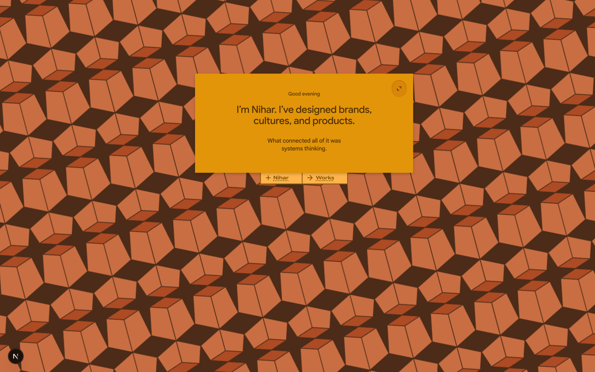

# The Portfolio

## The concept

The portfolio is a set of **long-form editorial project routes built as sheet-stack reading environments**. The audience is studio heads, creative directors, and product leaders — people who read for craft and intent, not recruiters skimming bullet points.

The single image everything traces back to is a **flatlay**: tickets, receipts, pressed leaves, pens, a watch face, a business card — laid out on a clean surface at an overhead angle, each object rotated slightly off-true, casting a soft shadow, with just enough room that the eye reads them as *placed*, not scattered. That grammar produces every downstream decision: the cream "mat" surface, the micro-rotation on content blocks, the restrained shadows, the paper-settle motion, and the rule that **proof artifacts stay proof artifacts** (a sketch reads as a real sketch, never as placeholder filler).

Core belief, stated plainly: **design is organized attention.** Each page is an authored reading environment. Tone is precise, calm, human — no hype, no abstraction.

## The structural metaphor (so the language makes sense)

The site talks about itself with a consistent physical vocabulary. You don't need the code, but knowing the words helps you read the project files:

- **Workbench** — the page-level desk surface (cream, with a thin black viewport frame).
- **Mat** — a graph-paper sheet; the base surface. Things sit *on* a mat.
- **Sheet** — a chapter-scale composition: a mat plus chapter chrome. "Each chapter has a mat."
- **Surface** — a content panel resting on a mat (e.g. Biconomy's "blue sheets").
- **Rail** — a note/annotation drawer tucked under a panel; only its label shows until opened.
- **Marker** — the small docked navigation tabs at the top of the viewport.

The throughline: **elements feel docked, tucked, or suspended with intention — never just placed nearby.** Notes dock to evidence; cards stack rather than list; reveals feel latent and then released.

## The route map

| Route | What it is |
|---|---|
| **`/`** (landing) | Hero, an about section that expands from short to long, a color "spectrum" interaction running from *Abstraction* to *Application*, and a contact form. The entry to everything. |
| **`/all`** | The **works hub** — a project showcase plus a cases timeline. Indexes the body of work (Connektion, Aleyr, Ecochain, Codezeros, Slangbusters, and the deep-dive case studies). Aliases: `/showcase`, `/cases`. |
| **`/biconomy`** | A full **product-design case study** — flows, features, demos. Built first; the design system descends from it. |
| **`/rr`** | **Rhythm & Reprogramming** — the most interactive route: a playable "Rug Rumble" game, an animated shader rug, scroll-driven mechanics. A case study you operate, not just read. |
| **`/marks`** | The **graphic-design timeline** — Nihar's marks/logos/identity work. His roots. Sits outside the case-study shell. |
| **`/shape-of-product`** | The **musings layer** — short-form writing/essays on product. The one place where new authoring is ongoing. |
| **`/resume`** | A minimal resume page. |
| **`/privacy`** | Privacy policy. |

## Motion, in one line

One easing curve governs everything: things glide, settle, and land. Long, calm durations. No bounce, no overshoot, no scroll hijacking. A faster micro-tier exists only for tiny UI flicks (tab switches). The feel is paper being set down, not UI snapping.

## The through-line to carry into any conversation

Nihar's work is about **small, deliberate interventions in live systems** — graphic, product, and infrastructural — unified by systems thinking and an editorial, reading-first sensibility. When brainstorming with him, match that: specific over grand, calm over loud, intervention over reinvention.
