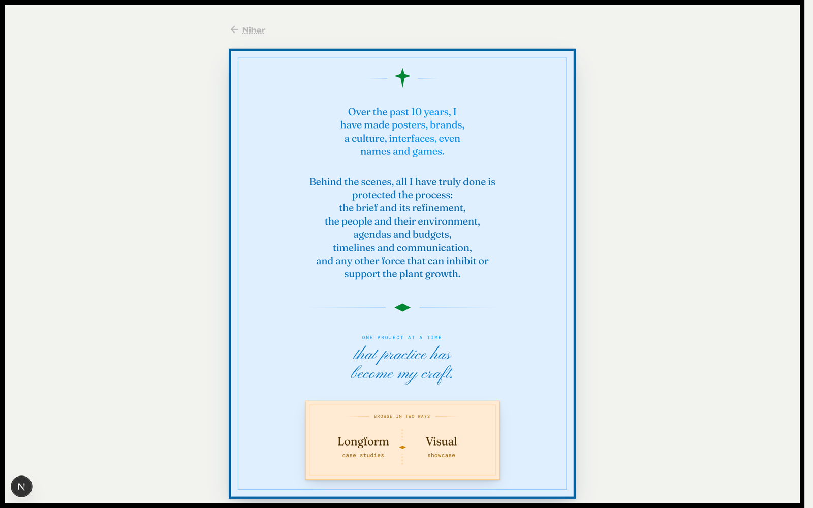

# All — the Works Hub — /all

**One line:** The Works hub — an engraved "invitation" essay that opens into two browse modes: a Longform career timeline (with case studies) and a Visual showcase grid.

## What it is

`/all` is the index for the whole body of work — the hub that all the standalone case studies hang off. It presents as a blue broadside card carrying a short first-person manifesto, footed by a letterpress "ticket" with two tabs. Choosing a tab opens the work beneath: **Longform** is the career timeline plus the Slangbusters case studies; **Visual** is a showcase grid of individual interfaces, brands, and marks. The deep case-study routes (Rug Rumble, Biconomy, Marks) live as their own pages — this hub is the connective surface that lists them and lets you cross into each.

## The story this page tells

A reader lands on the invitation: a two-stanza manifesto in gradient-clipped serif, with a closing line in script. The ticket footing the card offers "browse in two ways." Clicking a tab morphs the ticket into a pinned navbar and glides the page up so the work panel tops out — Longform on the left (the default), Visual on the right. In Longform, you read down a vertical career timeline anchored at "Now," with project cards (Rug Rumble, Biconomy), nameplate links to Names Coined and Marks and Symbols Made, and an inline dropdown that expands the three Slangbusters-era case studies. In Visual, a small category filter (All · Interface · Brand) heads a bento grid of ten pieces; tapping a tile opens a spec note with a short "what is it" and a "notice" line, plus a credit link back to the source project. A ✕ reverses the whole choreography back to the invitation.

## The projects it surfaces

- **Rug Rumble** — a 5-minute PvP card game; game design, card layouts, a game arena, built across three continents with playtesting.
- **Biconomy** — product design for web3 payments infrastructure; making invisible infra visible and usable (UX audit, demos, a concept UI, cultural interventions).
- **Slangbusters** — the creative studio; building the conditions that let it do its best work — studio rituals, hiring, and the operating system behind the work. (The studio under which Aleyr, Ecochain, and Codezeros were made.)
- **Aleyr** — pet-care brand work; finding the thin line between pet ownership and pet parenting. (Also the source of the Furrmark brandmark.)
- **Ecochain** — a B2B textile-trading platform; using the logic of a real desk to shape a digital trading workspace.
- **Codezeros** — branding a blockchain company before the category had a clear shape.
- **Connektion** — a job platform; job-stage status indicators (the "Job chip" components piece).
- **Mic Testing** — standup-comedy open-mic posters; studies in the Swiss grid.
- **Names Coined** — a naming body of work, marked work-in-progress.
- **Marks and Symbols Made** — the marks/symbols collection (its own route).
- **Startooth** — a tessellation pattern, a take on the classic houndstooth (from the sketchbook).
- **This site** — the portfolio's own site navigation marker, surfaced as a showcase piece.

## The actual copy

### The invitation manifesto

> Over the past 10 years, I have made posters, brands, a culture, interfaces, even names and games.

> Behind the scenes, all I have truly done is protected the process: the brief and its refinement, the people and their environment, agendas and budgets, timelines and communication, and any other force that can inhibit or support the plant growth.

Closing (eyebrow + script):

> One project at a time

> that practice has become my craft.

### The ticket (browse control)

> browse in two ways

> Longform — case studies *(left tab, default)*

> Visual — showcase *(right tab)*

### Timeline (Longform)

Anchor and greeting:

> Now

> Good morning / Good afternoon / Good evening

Year labels run down the rail: "2025", "Q4•25", "23", and "20 / 19 / 18" for the Slangbusters span.

Project cards:

> A 5-minute game, with a simple mechanic
> + card layouts, a game arena, and the process of building a game across 3 continents with playtesting.
> Game Designer • Rug Rumble

> Designs to make the invisible infra: visible and usable
> + a UX Audit, demos, a concept UI, and cultural interventions in a web3 ecosystem.
> Product Designer • Biconomy

> Building the conditions that let a creative studio do its best work
> + studio rituals, hiring, and the operating system behind the work.
> Creative Director • Slangbusters

Nameplates:

> Names Coined — W.I.P.

> Marks and Symbols Made

### Slangbusters case studies (the dropdown)

> Slangbusters case studies (3)

> Aleyr — Finding the thin line between pet ownership and pet parenting — Creative Director • Aleyr (2020)

> Ecochain — Using the logic of a real desk to shape a digital trading workspace — Creative Director • Ecochain (2019)

> Codezeros — Defining a blockchain company before the category had a clear shape — Creative Director • Codezeros (2018)

### Showcase pieces (Visual)

Filter: **All · Interface · Brand.** Each tile carries a type label, a title, and an opened spec note pairing "what is it" with "notice."

> Evolution of a playing card / Game Card UX / Rug Rumble / 2024
> A set showing how a PvP game card layout evolved
> The visual chunking is kept such that the card can be skimmed easily

Card-iteration captions (cardstack): "The very first hand-drawn concept" · "Added energy and name" · "Added conditional effects" · "First printed version" · "Final digital design"

> Vitals gauge for a PvP game / Game Interface / Rug Rumble / 2024
> Snapshot of card being played and its effects on the player
> The health bar separators make it easy to visually get an idea of the health without reading the numbers

> Site nav for the portfolio / Wayfinding Navigation / This site / 2026
> A navigation marker that works as a menu toggle + page title
> Inspired from the MagSafe snap, this one snaps to its neighbour

> Payments infra dashboard / Developer Dashboard / Biconomy / 2024
> A DevX comparison before and after applying a UX Audit
> The content in both the versions is same. Try it out using the switch.

> Multiverse theory / Design Intervention / Biconomy / 2023
> A poster talking about the silos within the workplace
> The copy and metaphor are done to just hint at the issue instead of shouting about it

> Startooth / Tessellation Pattern / My sketchbook / 2026
> My take on the classic Houndstooth
> The trapezoids are sliced by diamonds and stars to form edible barfis

> Furrmark / Brand Identity / Aleyr / 2021
> A brandmark for a pet care company
> Distillation of the face your pet makes when you put your hand on their head into a mark

> Standup comedy posters / Posters / Mic Testing / 2017
> Posters for social-media marketing of open mics
> Studies in the Swiss Grid that is running through them

> Job chip / Job Platform UI / Connektion / 2021
> Status indicators for tracking job stages
> Each stage is made to be understood at a glance via the position and length of the progress bar

> Ecochain / B2B SaaS / Ecochain / 2019
> Interface for a textile trading platform
> Traders can easily segregate the buying and selling functions by the way information is organized

### Exit marker

> Nihar (top-left, links home)

## Notes for a collaborator

- This is the connective hub, not a project in itself — it indexes everything. Use it to understand the *shape* of the body of work: a ten-year arc from posters and comedy marketing (Mic Testing, 2017) through studio-era brand and product work (Aleyr, Ecochain, Codezeros, Connektion under Slangbusters) into product design (Biconomy) and game design (Rug Rumble), plus ongoing personal threads (Names, Marks, the site itself).
- The voice is precise, calm, first-person, and quietly metaphorical — the through-line is "protecting the process" and "plant growth," framing design leadership as tending conditions rather than producing outputs. Riff in that register; avoid hype.
- Two ways to read the same body of work: Longform is chronological and role-framed ("Creative Director • …", "Product Designer • …"); Visual is artefact-first, each piece tagged Interface or Brand with a curatorial "what to notice." When brainstorming, you can pivot between the career narrative and the individual craft objects.
- Several entries point outward (Slangbusters case studies and some showcase credits link to external archives at niharbhagat.com / slangbusters.com / Behance); Names Coined is marked work-in-progress. Treat the timeline as the canonical index of which deep case studies exist.
