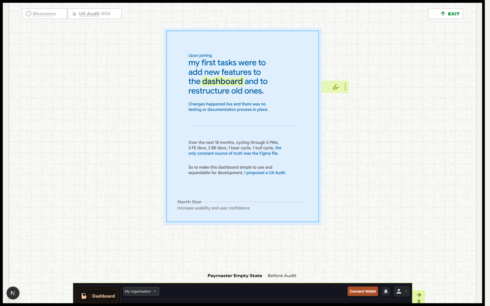

# Biconomy — /biconomy

**One line:** A long-form UX case study of Nihar's two years as a product designer at a blockchain payments infrastructure company — told as six chapters that trace his work from a formal dashboard audit out to playful side-experiments and the quiet discipline of staying anchored as the team churned around him.

## What it is
Biconomy is a blockchain payments infrastructure company — a platform for managing smart contracts and "gas tank" balances with custom configuration, used by web3 developers, growth reps, and early-to-mid-stage founders. Nihar was a Product Designer there. The case study covers the breadth of that role: restructuring a chaotic live dashboard, building demos to make invisible infrastructure tangible, starting an internal ideas pipeline, diagnosing a culture-alignment problem, running a sci-fi-inspired API design experiment, and keeping his own documentation as the only stable source of truth through constant team turnover.

## The story this page tells
The page opens on the **UX Audit** — Nihar arrives, finds a dashboard where changes happened live with no testing or documentation, and over 18 months of churn ("5 PMs, 3 FE devs, 2 BE devs, 1 bear cycle, 1 bull cycle") proposes a formal audit; an interactive before/after slider walks six dashboard flows and the reasoning behind each fix. From there it widens: **Demos** shows the prototypes he built between releases to make the SDK legible to prospects, ending with a fully on-chain game. **BIPs** tells how a personal list of teammates' ideas became "Biconomy Improvement Proposals," a real Notion workflow. **Multiverse** is the funniest and sharpest chapter — he discovers everyone on the team holds a different idea of what Biconomy is, names it "The Multiverse Theory," and turns it into a poster and a diagnosis he takes to the founders. **API concepts** is a speculative experiment pitching a sci-fi-inspired interface as Twitter threads. The page closes on **Staying Anchored** — by year two almost everyone he started with had left, and the chapter is about the documentation, the EIP-reading, and the relationships that kept him centered, ending on a pile of personal team photos.

## Key sections
- **UX Audit (Flows)** — the formal heart: a before/after slider across six real dashboard flows, each with annotated design-reasoning notes.
- **Demos** — prototypes built between releases to make the SDK tangible, across three tabs (Figma prototypes, web-based apps, on-chain game) that move from concrete to invisible.
- **BIPs** — how a personal idea-list became Biconomy Improvement Proposals, with a three-step Notion workflow and an embedded copy of it.
- **Multiverse** — the "Multiverse Theory" of team misalignment, rendered as a poster and a founder presentation.
- **API concepts** — a speculative "Science Fiction Meets Interface Fiction" API design experiment, pitched as Twitter threads.
- **Staying Anchored** — the closing reflection on turnover, self-documentation, and the relationships that kept the work coherent, with a photo stack.

## The actual copy

### Marker / who he was
> Product Designer at [Biconomy] — a blockchain payments infrastructure company

### Intro — the dashboard, the context
Memo cards (the latent context behind the intro):

> What Is It?
> A platform to manage smart contracts and gas tank balances with custom config.

> Who Uses It?
> All web3 blockchain devs, growth reps, early to mid stage founders

> Frequency of Use
> 2 consecutive sessions / 1–3 times / month

The running text:

> Upon joining, my first tasks were to add new features to the dashboard and to restructure old ones.

> Changes happened live and there was no testing or documentation process in place.

> Over the next 18 months, cycling through 5 PMs, 3 FE devs, 2 BE devs, 1 bear cycle, 1 bull cycle, *the only constant source of truth was the Figma file.*

> So to make this dashboard simple to use and expandable for development, *I proposed a UX Audit.*

North Star:

> North Star — Increase usability and user confidence

### Flows — the before/after audit
Switch: "Before Audit" / "After Audit". Counter: "Flow {N} of {total}". The six flows:

> Paymaster Empty State · Paymaster Overview · Gas Tank Setup · Paymaster Card · Register Paymaster Dialog · Network Change Prompt

A representative pairing — Flow 1, Paymaster Empty State:

Before:
> The empty state does not clearly signal what the user should do first.
> Explanatory content occupies the primary visual area before any setup action.
> Main action is gated behind reading and understanding long descriptions.
> Learning and execution are presented together, creating cognitive noise.

After:
> A single primary action is established and placed at the visual center of the screen.
> Explanatory content is moved below the primary action and reduced to a single supporting line.
> Commitment is lowered by allowing users to act before fully understanding the system.
> Learning resources are separated into secondary cards, off the main execution path.

(Each of the six flows carries this same before/after structure — diagnosing the old screen's cognitive load and explaining the calmer, action-first redesign. Other notable lines: "The 'Overview' doesn't surface key information at a glance," "The card is clickable but looks like a static block," "Users are asked to invent a name without any cue for what's acceptable," "The network list includes 30+ options, increasing scroll and decision time," "The version field has no context. Without reading docs, users don't know what it means," and on the fix side: "A sample name shows the expected format, removing guesswork," "A recommended tag to move the user along quicker.")

### Demos — making the invisible tangible
> Between dashboard releases, I worked with growth and marketing to create usable prototypes

> They were small functional stories showing what our SDK could do

Tabs: "Figma Prototypes" · "Web-Based Apps" · "On-Chain Game" · "Evolution of the Demos"

> Used when we needed to show how the SDK would fit into a prospect's existing dApp

> A live environment with real wallets and real transactions, with clear technical info at hand

> A fully on-chain game that uses our entire offering and one that feels fast and playful without exposing blockchain mechanics

> A standard game flow with four separate signing steps before the user could proceed

> The same flow collapsed into a single signing step

> The entry point to the demo: choosing a signer (wallet, social login, passkey) made real and usable rather than abstractions.

The closing quote:

> These demos went through a natural process of abstraction themselves, from the most tangible to the most invisible.

> Each demo made the invisible infrastructure into something people could see, use, and judge for themselves.

Sticker: "How we aspired to be known as" — *Web3 Abstractor*

### BIPs — Biconomy Improvement Proposals
> Everyone on the team had real good ideas about our culture, process, and products so I started keeping a list.

> This would go on to become Biconomy Improvement Proposals

> Six months later, during an internal tech-debt cleanup, I proposed a way to build these ideas out.

> So then, that simple checklist evolved into a small workflow on Notion.

Footer:
> Each Idea Moved — from an insight, to a proposal with legs, to a mock project.

Stats:
> Seven ideas surfaced / Three shipped

The workflow:

> The workflow was built around BIP #24001, a fully documented reference proposal

> 1. Know Your Idea — Contributors were first given a framework to clarify their idea by helping them with essential details required to strengthen it.

> 2. Present — The doc structure then shifted into a presentation order, so every proposal could be read and evaluated in a consistent way.

> 3. Evaluate — The final section captured stakeholder impressions, concerns, and suggested next steps.

> Taken together, the workflow gave people a clear starting point, a shared structure, and a single place for feedback.

> By following it, they could move an idea from insight to a real project.

> I had great support from the then PM (Nikola ♡) who introduced it to his devs. Then growth and marketing teams gave it a shot.

### Multiverse — the theory of misalignment
> After a year of remote work, I met the team at the annual offsite and realized each person carried a different idea of what Biconomy was.

> That turned into an internal joke. I called this The Multiverse Theory

> To test it, I ran one-on-one calls and asked simple questions* around directions and priorities.

> Surprisingly, the answers varied greatly.

> I turned that phenomenon into a poster which made the problem real while also carrying the humor with which this had started

> Once I had resonance with the core team, I presented the findings to the founders.

> They agreed with the diagnosis, unfortunately not the solutions.

> Still, it aligned the rest of the team. We began looping each other in more intentionally.

> Orange, the fruit, was part of our brand's secondary identity

### API concepts — Science Fiction Meets Interface Fiction
> This began as an experiment

> My hypothesis was that if sci‑fi can inspire rockets, how about an interface?

> This is where Science Fiction Meets Interface Fiction

Flow names: "Connecting Wallet" · "Sending Assets" · "Navigation & Signing". Sample slide captions:

> A standby mark, a stepper, and a receiver — each a grammar piece before connection.

> From a deployed smart wallet to a signed transaction — three steps on one continuous surface.

> Navigation collapses into the address itself — menu opens down, the asset library tucks below.

> Signing stays legible — network, request type, forwarder details, keys, then sign or reject.

The method:

> I read a few Asimov stories, hoping for a direction. I got ideas for the structure of the API and the way it will interface with the rest of the client dApp.

> Twitter was the primary channel for web3 discourse so I chose to pitch these ideas as threads rather than as a video or a deck.

The thread itself (as embedded):

> An experiment in API design: if sci‑fi can inspire rockets, how about an interface? A thread on Science Fiction meeting Interface Fiction — walking through the full context of this exploration.
> — Biconomy Experience (@BiconomyX), 9:14 AM · Aug 5, 2022

### Staying Anchored — the closing reflection
> By year two, almost everyone I'd started with had left.

> To stay centered, I kept my own documentation: decision logs, PM notes, founder goals, working styles. It became the best way to keep the threads connected.

> Outside the company, I tracked what was happening in web3, read the EIPs that mattered and translated the useful ones into features.

> Also, attended a few events and befriended some blockchain devs. The conversations with them informed some of the decisions on navigation and flow.

The photos read as a personal coda — captions like "The Biconomy design team," "The broader Biconomy gang," "Flor and me," "Georgios and me," "Flor, Azaan, and me at football," "Scooters in Baku," "A feast in Bali," "Breakfast."

## Notes for a collaborator
- **Tone is precise but warm, with dry humor.** The Multiverse chapter and the "1 bear cycle, 1 bull cycle" line show the register: self-aware, lightly funny, never glib. The serious craft (the flow audit) and the playful experiments (sci-fi API, on-chain game) sit comfortably in the same case study.
- **This is the breadth project.** Unlike a single-feature case study, Biconomy demonstrates range across two years — formal UX rigor, prototyping, internal process design, org diagnosis, speculative experiments, and quiet operational discipline. When riffing, lean into that span rather than treating it as one project.
- **The recurring theme is making the invisible legible** — whether it's blockchain infrastructure for prospects (Demos), a shared understanding of the company (Multiverse), or a stable source of truth amid churn (Staying Anchored). The arc moves from concrete/formal to invisible/personal, and it deliberately ends on people, not product.
- **The design language is "evidence."** Screens are real dashboard scans, the BIP workflow is a real Notion embed, the API thread is a real tweet, the closing is real photos. Nothing is placeholder — it all reads as proof of actual work.
