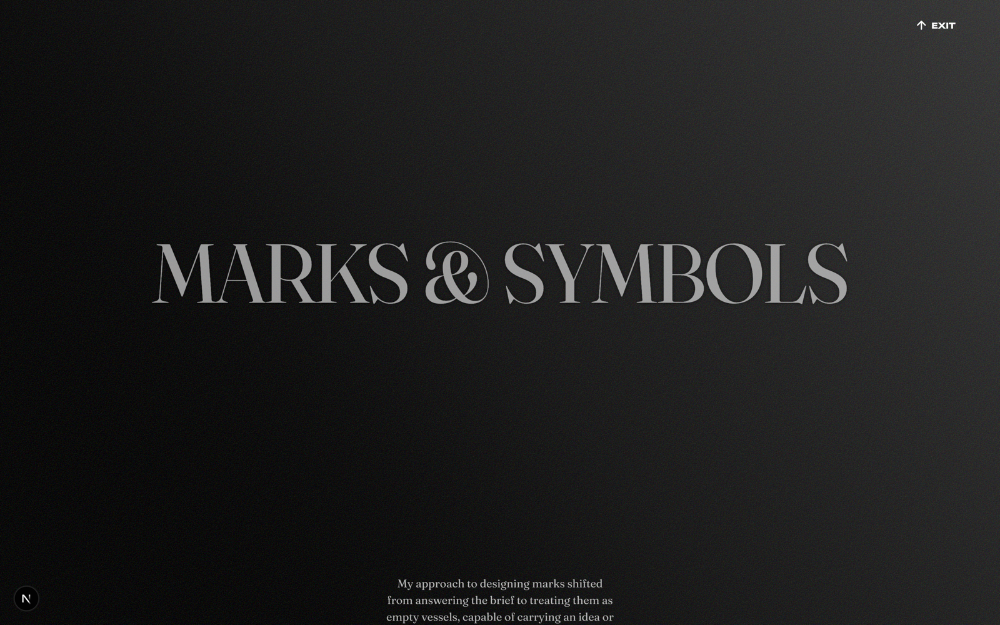

# Marks & Symbols — /marks

**One line:** A cinematic, self-playing credits reel of six logo marks Nihar designed between 2019 and 2024 — his graphic-design roots, shown as one continuous editorial document rather than a case study.

## What it is
`/marks` is the only route in the portfolio that isn't a sheet-stack case study. It reads as a single long reel: a title moment, an editorial intro, then six logo marks each presented in the same composition, looping back to the start indefinitely. The reader's job is simply to watch — the reel auto-advances, and someone who never touches anything still sees everything. Manual interaction (scroll, swipe, click) is allowed but never required.

## The story this page tells
The reel opens by withholding — a full-bleed title moment, "MARKS &" / "SYMBOLS," with no other content, earning its opening. As you scroll, the hero recedes to a watermark and a small docked title takes over. An editorial essay lays out Nihar's philosophy of marks and previews all six at once. Then each mark gets its own view: the background palette tweens into a new color, the mark and its caption fade up, and a carousel of application shots, sketches, and context plays through. At the bottom, a calm black void breathes before the reel teleports invisibly back to the opening title — so it feels genuinely infinite, only ever going forward.

## Key sections
- **Hero** — A title-only opening moment; "MARKS & SYMBOLS" at full size before it docks.
- **Essay** — Editorial intro on Nihar's approach to marks, then preview rows for all six; the only place you see them together.
- **Mark view (×6)** — One canonical composition, six instances; each varies only its palette, the mark artwork, the name, and the carousel of supporting graphics.
- **Loop** — A black void beat, then an invisible teleport back to the top — the reel never ends.

## The actual copy

### Hero title
> "MARKS &"
> "SYMBOLS"

### Docked title
> "MARKS & SYMBOLS"

### Essay
> "My approach to designing marks shifted from answering the brief to treating them as empty vessels, capable of carrying an idea or an emotion."

> "The process then became about uncovering that idea or emotion first, and letting the form emerge from it."

> "Over time, a mark surfaces: one that carries the feeling and also resonates with the client."

Between-row caption:
> "For me, marks are not decorations but transmissions."

Closing caption:
> "Here is a selection of some distilled ideas and emotions."

### The six marks

**Aleyr (Furrmark)** — 2021
> "This mark is the face your pet makes when your hand rests on its head."

Slide captions: "Early iterations" · "Refinement journey" · "Brand-book placement rules for the mark." · "Pages of the brandbook, turning." · "Logo lockup"

**Codezeros** — 2019
> "Is it read code-zeros, co-dezeros, codez-eros? The logotype solved for this ambiguity."

Slide captions: "Refinement" · "First drafts" · "Eyeballing color" · "Just fancy animation" · "Environmental signage at the studio's front desk."

**Slangbusters** — 2020
> "It begins with noise and ends in clarity, just like our clients going through the process."

Slide captions: "Early drafts" · "Relationship trials" · "Slangbusters logo cutout by Savan Prajapati" · "Studio's library stamp"

**Oscar Beringer** — 2023
> "[Concept] Solves for his name's pronunciation problem"

Slide captions: "Some fake mockups" · "It's bay-rohn-jay ffs!" · "Like I said previously…" · "Just"

**Ecochain** — 2022
> "Lovechild of a typeface and a spindle of thread"

Slide captions: "Presentation showing how a child is born" · "Fancy animation" · "Real work by Savan Prajapati" · "By Savan Prajapati + Akshar Dave"

**Kilti** — 2024
> "Clothing line. Cats. Triangles."

Slide caption: "House of Kilti with its owner"

### Exit
> "EXIT" (returns to the works hub)

## Notes for a collaborator
- The voice in the mark stories is dry, witty, and confident — short, declarative, occasionally self-deprecating ("It's bay-rohn-jay ffs!"). It treats a logo as a carrier of feeling, not decoration; "marks are not decorations but transmissions" is the thesis.
- This is the graphic-design / brand-identity chapter of the portfolio — the roots before the product-design work. Reading order is authored (divider → wordmarks → glyphs), not browsable.
- The defining quality is restraint: it withholds at the open, plays itself, and loops forever. When riffing, lean into the "credits reel" framing — pacing and atmosphere over interactivity.
- Several marks credit collaborators (Savan Prajapati, Akshar Dave) — the work is honest about being studio work, not solo heroics.
