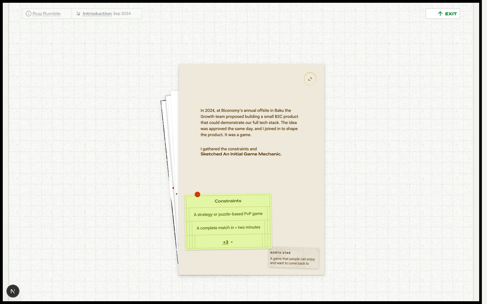

# Rhythm & Reprogramming — /rr

**One line:** A case study on designing Rug Rumble — a fast, memetic, web3 strategy card game — told through a reading environment you can actually play inside.

## What it is
This is Nihar's case study for **Rug Rumble**, a B2C strategy card game he designed as a Product Designer at Biconomy (a web3 infrastructure company). The game began as a Growth-team idea at the company's 2024 offsite in Baku: a small consumer product that could demonstrate Biconomy's full tech stack. Nihar joined to shape it and owned the product design — game mechanic, card system, and interface — through a "playable demo that helped developers understand and adopt our full-stack offering." The page documents that arc from a sketched mechanic to a launched game with thousands of players.

## The story this page tells
The reader moves through four chapters in time order, Sep–Dec 2024. **Intro** sets the origin (Baku, the constraints, the North Star) and shows the earliest hand sketches. A short interstitial line — "you don't learn how to swim by reading about it" — hands the reader straight into **Mechanics**, where the page stops describing and starts *demonstrating*: a playable mini-version of the core duel sits on the page, framed by a rules rail, a story-vs-structure card, and a note that warns "this is not the main game." As the reader scrolls, the mat splits and a second sheet slides in carrying the design's evolution — physical decks, cross-city playtesting, the MDA breakdown. **Cards** is the visual chapter: the card layouts evolving across five versions over three months, plus the Arena interface, all sitting on a live Balatro-style shader rug. **Outcome** lands the result — instant traction, the headline stats, the full rulebook, and a closing ticker that names the whole thing for what it was: a laugh in Baku that became a real product.

## Key sections
- **Intro** — Origin story (Biconomy offsite, Baku), the North Star, the constraints, and the first hand sketches.
- **Mechanics** — A playable Rug Rumble mini-game embedded in the page, with a flip-out rules rail, a "story / game structure" card, and a scroll-driven mat split that reveals the evolution narrative.
- **Cards** — Card-layout evolution (v1–v5) fanned out, and the Arena interface, both rendered over a live shader "rug."
- **Outcome** — The launch result, animated stats (3 months / 14K testnet users / 50K games), the full rulebook, and a closing ticker line.

## The actual copy

### Marker / role
- "Product Designer for"
- "a playable demo that helped developers understand and adopt our full-stack offering"

### Intro — the origin
- "In 2024, at Biconomy's annual offsite in Baku the Growth team proposed building a small B2C product that could demonstrate our full tech stack. The idea was approved the same day, and I joined in to shape the product. It was a game."
- "I gathered the constraints and"
- "Sketched An Initial Game Mechanic."

**North Star**
- "A game that people can enjoy and want to come back to"

**Constraints**
- "A strategy or puzzle-based PvP game"
- "A complete match in < two minutes"
- "A memetic visual language"
- "No possibility of a tie"
- "Visual restraint"

### Interstitial (Intro → Mechanics)
- "You don't learn how to swim by reading about it."
- "So here's the most rudimentary form of the game mechanic that evolved into complex meme-warfare."

### Mechanics — the rules rail (rudimentary version)
- "5 rounds, 6 cards each"
- "Higher number wins the round"
- "5 beats any two-digit card"
- "Played cards are discarded"
- "Unused cards shuffle back into the deck"

### Mechanics — the note rail
- "This Is Not The Main Game"
- "This is the rudimentary game mechanic that evolved into the main gameplay later"

### Mechanics — story card (evolution narrative)
- "Back in Bangalore, evolving this mechanic, we made and played with the first physical deck. We refined values, tested balance, and tweaked powers."
- "Then we shipped printed decks to remote teammates across four cities so everyone could join the playtesting."
- "We logged every match, noting not just balance issues but whether it passed the *only test*"

### Mechanics — game structure (the MDA breakdown)
- "Game Structure"

*// Mechanics (The code)*
- "3 types of cards: Attack, Defense, Special"
- "You can see 2 cards of your opponent"
- "Played card is discarded. Rest is shuffled back."
- "Goes on for 5 rounds"
- "There's a wager for more involvement"

*// Dynamics (The actions a player takes)*
- "The player has to analyze their own cards against their opponents while keeping in mind early or late stage of the game."
- "Low rule overhead (read: easy to understand)"
- "Two levels of randomness: shuffle before each round; player's choice of card in each round"
- "Time limit per round to keep the game under 5 min"

*// Aesthetics (What the player feels)*
- "Visual treatment → web3 memetic universe"
- "Overarching feeling: Bullishness / Winning / Pride"

### Mechanics — the playable game (board copy)
- "Number" / "Duel" (idle title), "Start game"
- "Memorize!" / "Revealing..." / "Round {round} of {totalRounds}"
- "Pick a card"
- "You win the round!" / "Opponent wins!" / "5 traps! You win!" / "5 traps! Opponent wins!"
- "VICTORY" / "DEFEAT" / "Play again"

### Cards — section titles
- "Evolution of the Card Layouts" / "Over a Period of 3 Months"
- "The Arena"

**Card-layout versions**
- v1 — "The very first hand-drawn concept"
- v2 — "Added energy and name"
- v3 — "Added conditional effects"
- v4 — "First printed version"
- v5 — "Final digital design"

**The Arena interface — design notes**
- "All illustrations: the characters, the arena, and the cards are created by Florencia de Pamphilis, adding to the mematic visual language."
- "I've designed the arena to hold focus on a single decision for the player: which card to play this round."
- "The health bar is segmented, so players can read their status at a glance."
- "A compact bottom bar shows time, round number, and settings. Easy to access but not distracting."
- "Everything else is deliberately kept out of the way."

### Outcome — the result
- "The final game launched with instant traction. Low rule overhead, quick matches, and meme energy made it an easy pick-up."
- "The adoption was so strong that the two people leading the project left the company to form a startup with Rug Rumble."

**Stats:** 3 Months · 14K Testnet Users · 50K Games Played

### Outcome — the rulebook (Rug Rumble proper)
- "**Rug Rumble** is a fast-paced card game for 2 players, played with 7 cards per deck over 5 rounds." (2 Players / 7 Cards / 5 Rounds)
- "Each card costs 1 to 4 Energy. You get 12 per match. *Use it wisely.*"
- Gameplay: "Reveal Cards" → "At the start of each round, 2 random cards from each player's deck are revealed to both players." · "Choose a Card" → "Each player picks one card to play. The unchosen card goes back to the draw pile and is shuffled." · "Lock in Choices" → "Both cards are revealed, and their effects are resolved simultaneously."
- Card types: "Apply special effects (e.g., disable shields, flip opponent's card)" (Power) · "Block attacks by adding a shield" (Defense) · "Restore your own health" (Heal) · "Deal damage to your opponent's health" (Attack)
- Resolution order: Power → Defense → Heal → Attack. "Defense shields are applied before any damage is calculated."
- Winning: "Both players start with 100 health." · "A player's health drops to zero" · "The player with the higher health wins" · "Tiebreakers: Defense and remaining energy act as tiebreakers if health is tied."

### Outcome — closing ticker
- "What started as a laugh in Baku became a live product with thousands of players, a proof that a simple, well-balanced mechanic can travel far"

## Notes for a collaborator
- This is the **most playful and interactive route in the portfolio**. The case study doesn't just describe the game — it embeds a working mini-version, an evolving card fan, a live Balatro-derived shader "rug" as the reading surface, and a scroll-bound mat-split animation. The medium is the argument: "you don't learn how to swim by reading about it."
- The two visual registers sit side by side intentionally. RR's chapters live on a **dark, saturated shader rug** — a deliberately different reading environment from the calm cream paper of the rest of the site, chosen to carry the "web3 memetic universe" energy (bullishness / winning / pride) without abandoning visual restraint.
- The voice stays Nihar's throughout — precise, plain, a little dry-funny ("complex meme-warfare," "a laugh in Baku"). It frames design decisions in terms of the player's experience and the project's constraints, not jargon. When riffing, keep that register: confident, specific, never hype.
- Useful framing for brainstorms: this is a **product-design-meets-game-design** story with a clean MDA spine (Mechanics / Dynamics / Aesthetics), a hard North Star ("a game people want to come back to"), tight constraints (sub-two-minute matches, no ties, memetic look), and a concrete outcome (the two project leads spun it out into a startup). Illustration credit belongs to Florencia de Pamphilis.
