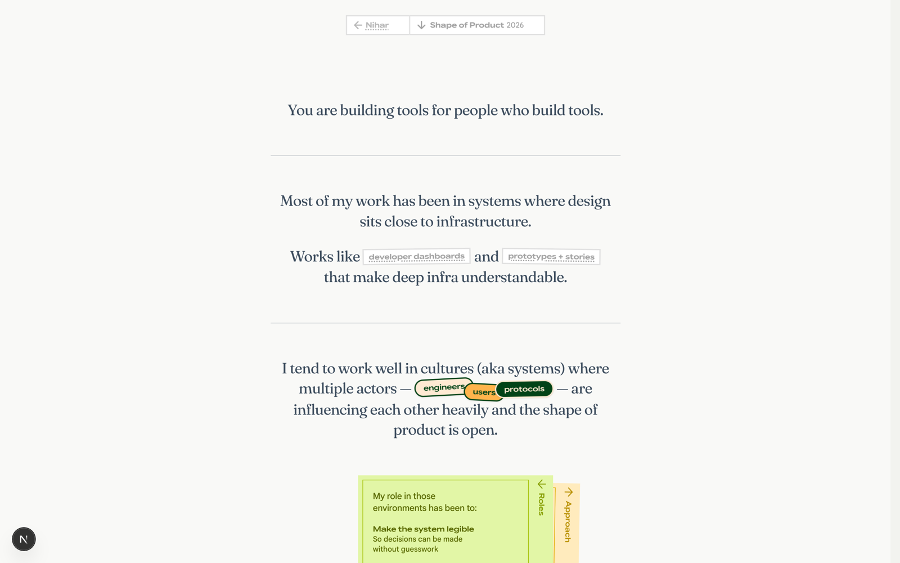

# Shape of Product — /shape-of-product

**One line:** A calm, first-person editorial musings page about how Nihar works — designing systems where design sits close to infrastructure — written for craft-conscious companies he wants to work with.

## What it is
`/shape-of-product` is an editorial musings page, not a case study and not a portfolio piece. It sits alongside the main body of work the way an essay sits beside it — commentary about the work rather than the work itself. Nihar uses it when applying to companies whose craft he admires (Figma, Basecamp, and similar). It's a single editorial column: prose, two cards, a sign-off. It's also the one sanctioned place in the otherwise-finished portfolio where new writing can grow.

## The story this page tells
The reader's only job is to read — no scroll choreography, no auto-advance, no chapters. It opens with a single framing line, then a two-line statement of what Nihar works on, with inline links out to specific chapters of his Biconomy case study. A breath, then the sentence about where he works well — with three little stickers (engineers, users, protocols) sitting inline. Two notes-style cards follow, "Roles" and "Approach," that you can swap by clicking the inactive one's tab. Another breath, and a closing identity card greets you by time of day and signs off: "I'm Nihar." The card lands tilted two degrees; click it once and it settles flat — a small, one-way bit of whimsy.

## Key sections
- **Lede** — The opening framing line, a divider, then the "what I work on" two-line statement with inline chapter links.
- **Tend** — The sentence about the kinds of systems Nihar works well in, with engineers / users / protocols as inline stickers.
- **Roles ↔ Approach stack** — Two z-stacked notes-rail cards; click the inactive tab to swap which is on top.
- **Sign-off card** — A time-of-day greeting and an "I'm Nihar" closing identity artifact; lands tilted, clicks to settle.

## The actual copy

### Lede
> "You are building tools for people who build tools."

> "Most of my work has been in systems where design sits close to infrastructure."

> "Works like *developer dashboards* and *prototypes + stories* that make deep infra understandable."

(The italicized phrases — "developer dashboards" and "prototypes + stories" — are inline links into specific chapters of the Biconomy case study.)

### Tend
> "I tend to work well in cultures (aka systems) where multiple actors — *engineers, users, protocols* — are influencing each other heavily and the shape of product is open."

Actor stickers: "engineers" · "users" · "protocols"

### Roles card
> "My role in those environments has been to:"

- **Make the system legible** — "So decisions can be made without guesswork"
- **Prototype flows early** — "So behavior is tested before it's abstracted"
- **Work closely with engineers** — "Not as handoff, but as shared problem-solving"
- **Reduce complexity without flattening it** — "Especially in technical contexts"

### Approach card
> "Start with ambiguity."
> "Stay with it long enough to understand the forces."
> "Then shape it into something that can actually be built and used."

### Sign-off card
> "Good morning" / "Good afternoon" / "Good evening" (by time of day)

> "I'm Nihar. I've designed brands, cultures, and products."

> "What I was really doing was designing systems"

### Nav
> "Shape of Product" · "2026"

## Notes for a collaborator
- The voice is first-person, calm, specific, and unpitched — it reads as something Nihar actually wrote, not as a cover-letter-shaped surface. Generous density; the layout exists to give the prose room.
- The throughline is "I design systems" — the brands, cultures, and products were all really systems work. The page reframes Nihar's whole career under that lens.
- Tone of restraint matters: quiet motion, no CTAs, no contact form. If the reader wants to reach out, the application (the email that linked here) is the channel.
- This is the sanctioned home for new musings — when brainstorming additional essays or thoughts, this register (editorial, first-person, systems-minded, never salesy) is the one to match.
